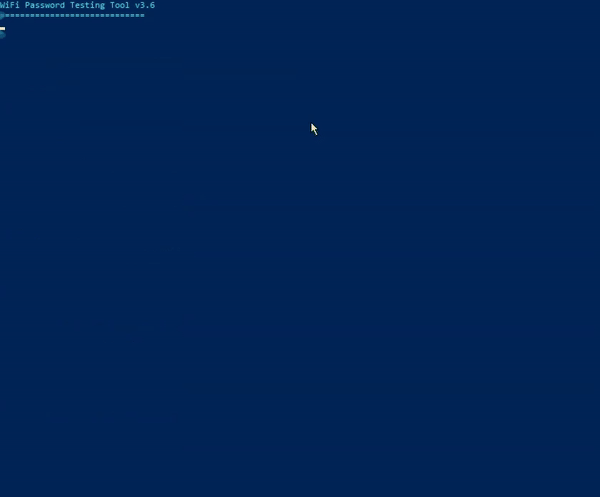

# 🔐 Bruteforce WiFi 

## Bruteforce Password Tester for Windows

[](https://github.com/EOF7/bruteforce-WiFi)
[](https://github.com/EOF7/bruteforce-WiFi)
[](https://github.com/EOF7/bruteforce-WiFi)
[](LICENSE)

## 📖 Overview

A sophisticated PowerShell-based WiFi security testing tool designed for ethical hackers and network administrators. This tool systematically tests WiFi password security through customizable parameters and intelligent password generation.

⚠️ **Important**: Use only for authorized testing and educational purposes.

## 🎥 Demonstration



## 📥 Installation

1. Clone the repository:
```bash
git clone https://github.com/EOF7/bruteforce-WiFi.git
```

2. Ensure prerequisites are met:
   - PowerShell 5.1 or higher
   - Windows 10/11
   - Compatible wireless adapter

3. Configure PowerShell execution policy:
```powershell
Set-ExecutionPolicy -ExecutionPolicy Bypass -Scope Process
```

4. Verify wireless adapter compatibility:
```powershell
Get-NetAdapter | Where-Object {$_.MediaType -eq "Native 802.11"}
```

## 💻 System Requirements

- **OS**: Windows 10/11 (64-bit)
- **RAM**: 4GB minimum (8GB recommended)
- **Processor**: Dual-core 2GHz or better
- **PowerShell**: Version 5.1 or higher
- **Network Adapter**: 802.11ac/ax compatible
- **Storage**: 100MB free space
- **Permissions**: Administrator rights

## ✨ Features

### 🔄 Core Features
- Intelligent password generation algorithms
- Real-time connection state management
- Advanced error handling and recovery
- Memory-optimized operations
- Detailed logging system

### 🛠️ Technical Capabilities
- Multi-protocol security testing
- Signal strength validation
- Connection state monitoring
- Custom wordlist support
- Performance optimization

### 📊 Monitoring & Analytics
- Real-time progress tracking
- Speed and performance metrics
- Success rate monitoring
- Detailed test logging

## 🚀 Quick Start

1. **Run as Administrator**:
```powershell
powershell -ExecutionPolicy Bypass -File .\bruteforce-WiFi.ps1
```

2. **Select Network Adapter**:
```
[0] Intel(R) Wireless-AC 9560
    MAC: 00:11:22:33:44:55
    GUID: {XXXXXXXX-XXXX-XXXX-XXXX-XXXXXXXXXXXX}
```

3. **Choose Target Network**:
```
Available Networks:
==================
[0] TargetNetwork_5G
    Signal: 85% | Security: WPA2-Personal
```

## ⚙️ Advanced Configuration

```powershell
$CONFIG = @{
    PasswordLength = 8            # Minimum password length
    MaxPasswords = 100000        # Maximum passwords to test
    ScanTimeout = 10            # Network scan timeout (seconds)
    ConnectionTimeout = 3       # Connection attempt timeout
    RetryAttempts = 0          # Number of retry attempts
    ScanDelaySeconds = 3       # Delay between scans
    MinSignalStrength = 20     # Minimum signal strength required
    DebugMode = $false         # Enable detailed logging
}
```

## 🔒 Supported Security Protocols

- WPA2-Personal (AES/TKIP)
- WPA3-Personal
- WPA-Personal
- Mixed Mode (WPA2/WPA3)
- Enterprise modes (limited support)

## 📝 Logging System

### Log Levels
- `INFO`: General operations
- `DEBUG`: Detailed debugging
- `ERROR`: Error tracking
- `SUCCESS`: Successful attempts

### Log Files
- `scan_[timestamp].log`: Main operation log
- `debug_[timestamp].log`: Detailed debug information
- `success_[timestamp].txt`: Successful password finds
- `wrong_passwords.txt`: Failed attempts

## 🔧 Troubleshooting

### Common Issues
1. **Connection Failures**
   - Verify adapter compatibility
   - Check signal strength
   - Ensure correct security type

2. **Performance Issues**
   - Close competing WiFi applications
   - Verify system resources
   - Check adapter drivers

3. **Adapter Problems**
   - Update wireless drivers
   - Verify Windows compatibility
   - Check physical connections

## 🚀 Performance Optimization

- Real-time connection state management
- Memory-efficient password testing
- Process priority optimization
- Intelligent retry mechanisms
- Optimized scanning algorithms

## ⚠️ Limitations

- Windows-only support
- Sequential testing only
- Adapter-dependent performance
- Limited enterprise protocol support
- Memory constraints for large wordlists

## 🔗 Related Projects

- [WiFi Analyzer Tools](https://github.com/topics/wifi-analyzer)
- [Network Security Tools](https://github.com/topics/network-security)
- [Wireless Testing Tools](https://github.com/topics/wireless-testing)

## 📜 License

This project is licensed under the MIT License - see the [LICENSE](LICENSE) file for details.

## 🏷️ Tags

`#WiFiSecurity` `#NetworkTesting` `#PowerShell` `#EthicalHacking` `#CyberSecurity` `#PenTesting` `#WindowsTools` `#NetworkAudit` `#WPA2` `#WPA3` `#WiFi` `#WLAN` `#wifi-analyzer` `#network-security` `#wireless-testing` `#wireless` `#bruteforce` `#brute-force` `#passwords` `#password-list`  `#wlan-hack`  `#wifi-hack`  `#windows`  `#windows-powershell`    
